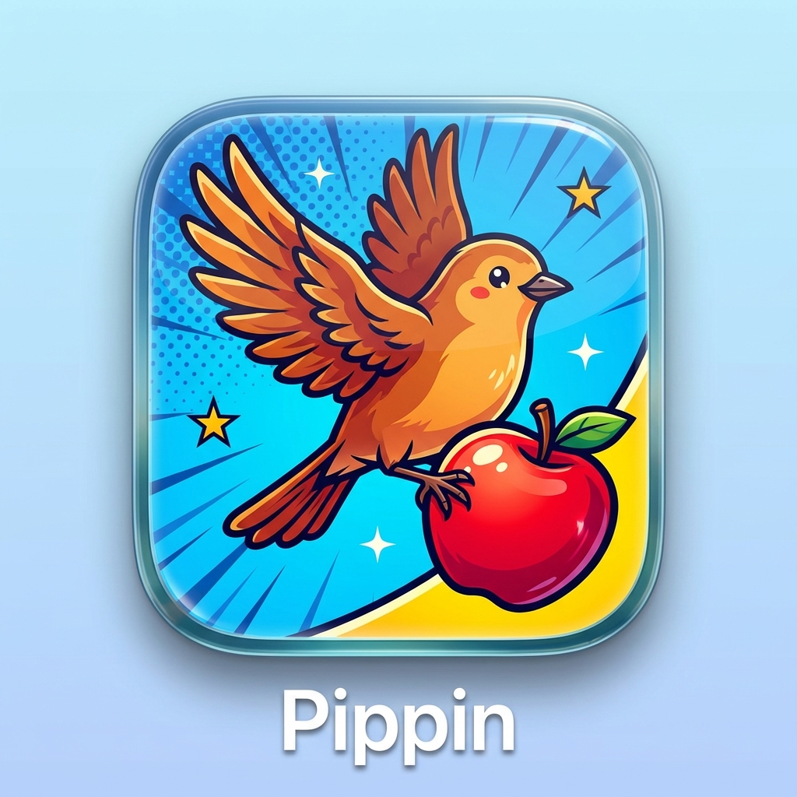

<p align="center">
  
</p>

<h1 align="center">pippin</h1>

<p align="center">
  <strong>Your Apple apps, one CLI away.</strong><br/>
  Headless automation for Mail, Calendar, Reminders, Notes, Contacts, Voice Memos, and more — built for AI agents and power users.
</p>

<p align="center">
  <a href="https://github.com/mattwag05/pippin/releases/latest"></a>
  <a href="LICENSE"></a>
  
  
</p>

---

pippin gives AI agents and scripts structured access to sandboxed Apple apps that are normally locked behind GUI-only automation. Every command outputs clean JSON (`--format json`) or token-efficient compact JSON (`--format agent`) — ready to pipe into `jq`, feed to an LLM, or wire into a cron job.

```
pippin mail list --unread --format agent
pippin calendar today
pippin reminders list "Work"
pippin notes search "meeting"
pippin memos summarize <id> --provider ollama
pippin contacts search "Alice"
pippin browser open "https://example.com"
pippin audio speak "Hello"
```

## Install

**Homebrew** (recommended):

```bash
brew install mattwag05/tap/pippin
```

**Pre-built binary** (arm64, macOS 15+):

```bash
curl -LO https://github.com/mattwag05/pippin/releases/latest/download/pippin-$(pippin --version 2>/dev/null | awk '{print $2}')-arm64-macos.tar.gz
# or grab a specific version:
curl -LO https://github.com/mattwag05/pippin/releases/download/v0.14.2/pippin-0.14.2-arm64-macos.tar.gz
tar xzf pippin-*.tar.gz && mv pippin-*-arm64-macos ~/.local/bin/pippin
```

**Build from source** (Xcode 16+ / Swift 6.2+):

```bash
git clone https://github.com/mattwag05/pippin.git && cd pippin
make install
```

## Setup

pippin accesses sandboxed Apple apps — macOS needs explicit permission grants.

```bash
pippin init     # Guided setup — walks through each permission
pippin doctor   # Verify everything works
pippin status   # Dashboard: accounts, events, reminders, permissions
```

You'll need to grant permissions in **System Settings > Privacy & Security**:

| Permission | For |
|---|---|
| Full Disk Access > Terminal.app | Voice Memos |
| Automation > Mail > Terminal.app | Mail |
| Calendars > Terminal.app / pippin | Calendar |
| Reminders > Terminal.app / pippin | Reminders |
| Contacts > Terminal.app / pippin | Contacts |
| Automation > Notes > Terminal.app | Notes |

> **Tip:** Permission is per binary path. After a new build or install, run each subcommand once interactively to trigger the TCC prompt.

## Commands

### Mail

```bash
pippin mail list --unread --limit 5
pippin mail search "quarterly report" --after 2026-01-01
pippin mail show "acct||INBOX||12345"
pippin mail reply "acct||INBOX||12345" --body "Thanks!"
pippin mail forward "acct||INBOX||12345" --to other@example.com
pippin mail send --to user@example.com --subject "Hello" --body "Hi there" --dry-run
pippin mail attachments "acct||INBOX||12345" --save-dir ~/Downloads
pippin mail mark "acct||INBOX||12345" --read
pippin mail move "acct||INBOX||12345" --to Archive
```

### Voice Memos

```bash
pippin memos list --since 2026-01-01
pippin memos export <uuid> --output ~/Desktop/memos --transcribe
pippin memos summarize <uuid> --template meeting-notes
pippin memos summarize <uuid> --provider ollama --model gemma4:latest
pippin memos templates list
```

### Calendar

```bash
pippin calendar today
pippin calendar events --from 2026-04-01 --to 2026-04-30 --calendar "Work"
pippin calendar agenda --days 3
pippin calendar smart-create "Coffee with Alice next Tuesday at 2pm" --dry-run
pippin calendar create --title "Team standup" --start "2026-04-07 09:00"
```

### Reminders

```bash
pippin reminders lists
pippin reminders list "Work" --due-before 2026-04-15 --priority high
pippin reminders create "Submit report" --list "Work" --due "2026-04-10" --priority high
pippin reminders complete <id>
pippin reminders search "report"
```

### Notes

```bash
pippin notes list --folder "Work"
pippin notes search "project kickoff"
pippin notes create "My note" --body "Content here" --folder "Work"
pippin notes edit <id> --body "Extra line" --append
```

### Contacts

```bash
pippin contacts search "Alice" --fields "name,email"
pippin contacts show <id>
pippin contacts groups
```

### Audio

```bash
pippin audio speak "Hello, world" --voice af_bella
pippin audio transcribe ~/recordings/meeting.m4a
pippin audio voices
```

### Browser

Requires Node.js and Playwright WebKit (`npx playwright install webkit`).

```bash
pippin browser open "https://example.com"
pippin browser snapshot            # Accessibility tree — ideal for AI agents
pippin browser screenshot --output ~/Desktop/shot.png
pippin browser click --ref "e12"
pippin browser fill --ref "e5" --value "search query"
pippin browser fetch "https://example.com"
```

### Interactive Shell (REPL)

```bash
pippin shell                        # Start interactive session
pippin                              # Same — bare pippin defaults to REPL
pippin shell --format json          # All commands in session output JSON
echo "calendar agenda" | pippin shell --format agent  # Pipe mode for scripting
```

Inside the REPL, type commands without the `pippin` prefix:

```
pippin> mail accounts
pippin> mail list --account Work --unread
pippin> calendar agenda
pippin> quit
```

### Output Formats

Every command supports three modes:

| Flag | Description |
|---|---|
| `--format text` | Human-readable tables and cards (default) |
| `--format json` | Pretty-printed JSON for scripting |
| `--format agent` | Compact JSON, minimal tokens — built for LLM pipelines |

## AI Configuration

`memos summarize` and `calendar smart-create` use an LLM for natural language processing. pippin supports local inference via Ollama and cloud inference via Claude.

```json
{
  "ai": {
    "provider": "ollama",
    "ollama": {
      "model": "gemma4:latest",
      "url": "http://localhost:11434"
    },
    "claude": {
      "model": "claude-sonnet-4-6"
    }
  }
}
```

Save to `~/.config/pippin/config.json`, or override per-command:

```bash
pippin memos summarize <id> --provider ollama --model qwen3.5:latest
pippin memos summarize <id> --provider claude
```

| Provider | Setup | Speed |
|----------|-------|-------|
| `ollama` (default) | [Install Ollama](https://ollama.com), then `ollama pull gemma4` | ~22s/summary (Gemma 4) |
| `claude` | Set `ANTHROPIC_API_KEY` env var | ~2-3s/summary |

> **Model note:** Gemma 4 is recommended over Qwen 3.5 for pippin's summarization tasks — Qwen's chain-of-thought reasoning adds ~2x latency without proportional quality gains on structured extraction.

## Sample Workflows

```bash
# Morning briefing (REPL mode — one process, multiple commands)
echo -e "calendar today\nreminders list Work\nmail list --unread --limit 10" \
  | pippin shell --format agent

# Same thing, one-shot style
pippin calendar today --format agent
pippin reminders list "Work" --format agent
pippin mail list --unread --limit 10 --format agent

# Export and transcribe today's voice memos
pippin memos list --since $(date +%Y-%m-%d) --format json \
  | jq -r '.[].id' \
  | xargs -I{} pippin memos export {} --output ~/memos --transcribe

# Find unread emails from a specific sender
pippin mail list --unread --format json \
  | jq '.[] | select(.from | contains("boss@company.com"))'
```

## Architecture

| Component | Description |
|---|---|
| `pippin/MailBridge/` | JXA script builder for Mail.app |
| `pippin/MemosBridge/` | GRDB SQLite access to Voice Memos |
| `pippin/CalendarBridge/` | EventKit wrapper for Calendar |
| `pippin/RemindersBridge/` | EventKit wrapper for Reminders |
| `pippin/NotesBridge/` | JXA subprocess bridge for Notes.app |
| `pippin/ContactsBridge/` | CNContactStore wrapper (read-only) |
| `pippin/AudioBridge/` | mlx-audio Python subprocess (TTS/STT) |
| `pippin/BrowserBridge/` | Playwright WebKit with persistent sessions |
| `pippin/AIProvider/` | Ollama + Claude backends for summarization |
| `pippin/Commands/ShellCommand.swift` | Interactive REPL with argument parsing and session-wide format |
| `pippin/Formatting/` | Text tables, JSON output, agent compact output |

Swift 6 strict concurrency enforced across the entire codebase. JXA bridges shell out to `osascript`; EventKit bridges use the framework directly.

## Requirements

- **macOS 15+** (Sequoia) or later
- **Swift 6.2+** for source builds; pre-built binaries are arm64
- **Node.js + Playwright** — `pippin browser` only
- **mlx-audio** — `pippin audio` and `pippin memos transcribe` only
- **Ollama** — `pippin memos summarize` with local AI (optional; Claude works without it)

## Development

```bash
make build      # Release build
make test       # Run tests (1049 tests, 0 failures)
make lint       # swiftformat lint
make install    # Build + install to ~/.local/bin
```

## License

Apache 2.0 — see [LICENSE](LICENSE).
